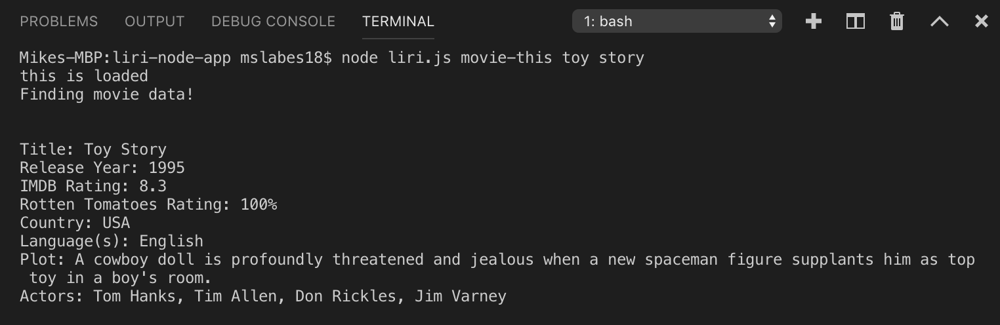
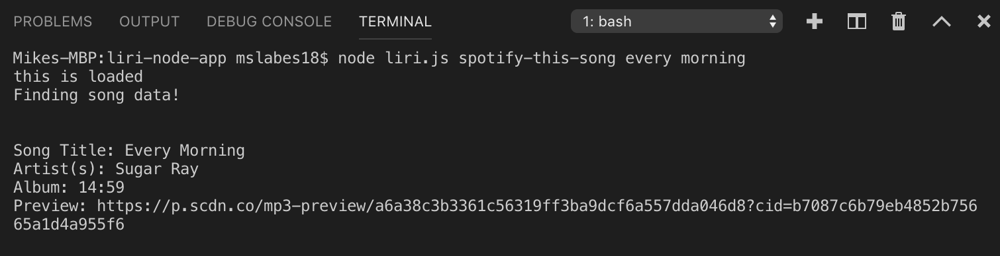
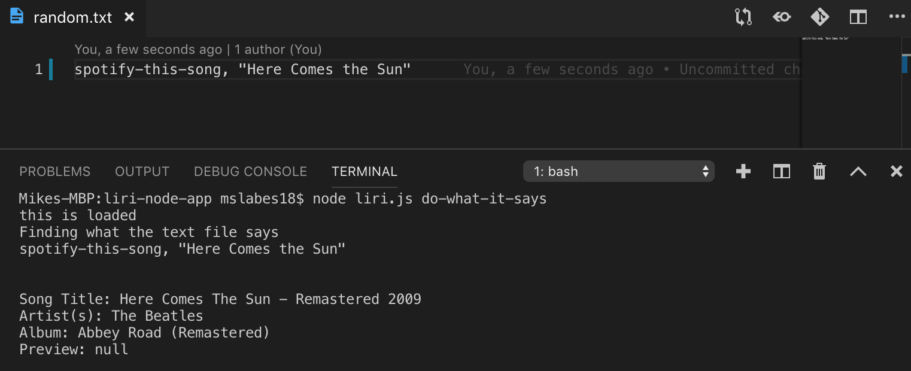

# liri-node-app

LIRI is command line node application that takes in parameters and gives you back data. Similar to iPhone's SIRI, which is a Speech Interpretation and Recognition Interface, LIRI is a Language Interpretation and Recognition Interface. There are three categories of data you can pull from LIRI, song data from Spotify's API, movie data from the OMDB API, and concert data from the Bands in Town API. 

By typing in "movie-this" followed by a movie, LIRI will return the movie title, when it was released, the ratings it received, country it was made in, languages in the movie, the plot, and the main actors.

By typing in "spotify-this-song" followed by a song, LIRI will return the song title, artist, album, and a link to a preview of the song.

The last feature is the command "do-what-it-says". This will return the command that is written in the .txt file. The command must be one of the three previous options. In this example, the .txt file requested song information.  

